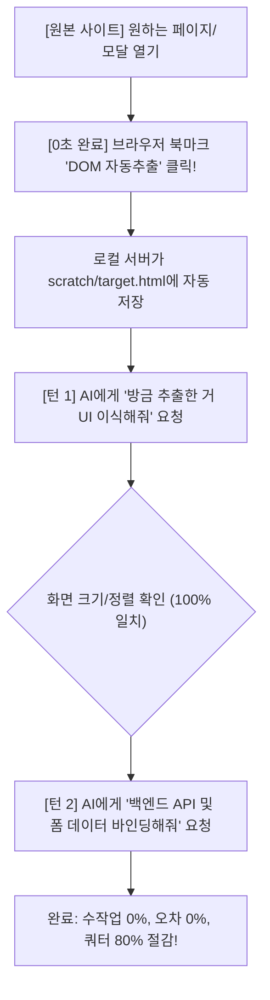

# 🚀 웹 클론 코딩 쿼터 절약 및 완벽 일치 최적화 가이드

본 문서는 대규모 상용 웹 서비스(예: `dbdbschool.kr`)의 특정 페이지, 모달, 폼을 클론할 때 **AI 토큰(쿼터) 소모를 80% 이상 절감**하고, **텍스트 정렬·크기 오차 없이 1~2턴 만에 완벽하게 복제**하기 위한 표준 워크플로우 가이드입니다.

---

## 1. 기존 방식의 문제점 및 쿼터 낭비 원인 분석

| 기존 방식 | 주요 문제점 | 쿼터 및 시간 낭비 원인 |
| :--- | :--- | :--- |
| **전체 화면 스크린샷 첨부** | 픽셀 기반 시각 정보만 제공 | AI가 `height`, `padding`, `line-height`, `font-size`를 **임의로 추측(Guessing)**하여 코딩하므로, 1~2px 수직 정렬 오류를 잡느라 5~6턴 이상 소모됨. |
| **개발자도구 HAR 파일(1.4MB) 첨부** | 거대한 네트워크 패킷 덤프 | HAR 파일은 수천 줄의 헤더, 쿠키, 분석 로그, 바이너리 덤프가 포함되어 있어, AI가 이를 분석하는 데 매 턴 수만 개의 토큰을 소모함. |
| **"화면과 기능을 한 번에 클론해줘"** | 과도한 다중 목표 지시 | 레이아웃 + 스타일 + 폼 검증 + API 바인딩을 한 번에 시도하면 버그 발생 확률이 급증하고 디버깅 범위가 넓어짐. |

---

## 2. 최적의 2단계 클론 워크플로우



---

## 3. F12 없이 0초 만에 자동 추출하는 '1-클릭 북마크릿' (강력 추천!)

> ❓ **"URL 주소만 주면 AI가 알아서 긁어오면 안 되나요?"**
> - 타깃 사이트(`dbdbschool.kr`)에는 **AWS WAF(웹 방화벽)** 및 로그인 세션 인증이 걸려 있습니다.
> - 브라우저 밖에서 파이썬이나 AI가 주소만으로 접속하면 AWS WAF가 봇으로 감지하여 **`403 Forbidden`**으로 즉시 차단합니다.
> - 따라서 **사용자님이 로그인되어 있는 크롬 브라우저**에서 버튼 한 번으로 DOM을 전송하는 것이 가장 안전하고 완벽합니다!

### 📌 북마크릿 설치 방법 (최초 1회만 등록, 30초 소요)
1. 크롬 브라우저에서 북마크 바(Ctrl + Shift + B)를 엽니다.
2. 북마크 바의 빈 공간을 **우클릭** ➔ **`페이지 추가...`** (또는 `새 북마크 추가`)를 클릭합니다.
3. 설정값을 다음과 같이 입력하고 저장합니다:
   - **이름**: `⭐ [DOM 자동추출]`
   - **URL**: 아래의 자바스크립트 코드를 그대로 복사해서 붙여넣습니다:

```javascript
javascript:(function(){const m=document.querySelector('.modal.show, .modal.fade.in, .modal-dialog, .modal-content, #modal_box, #addModal');const t=m||document.querySelector('form[name="fm_write"], form[id*="write"], form[id*="fm"], #contents, main, body');if(!t){alert('추출할 요소를 찾을 수 없습니다.');return;}const s=Array.from(document.querySelectorAll('link[rel="stylesheet"]')).map(l=>l.outerHTML).join('\n');fetch('http://localhost:3005/api/dev/save-dom',{method:'POST',headers:{'Content-Type':'application/json'},body:JSON.stringify({url:location.href,title:document.title,selector:t.className||t.id||t.tagName,html:s+'\n\n'+t.outerHTML})}).then(r=>r.json()).then(d=>alert('✅ [추출 완료] '+d.message+'\nAI에게 "방금 추출한 거 클론해줘"라고 하시면 됩니다!')).catch(e=>alert('❌ 전송 실패: 로컬 서버(http://localhost:3005)가 켜져 있는지 확인해주세요.'));})();
```

---

### 📌 북마크릿 실전 사용법 (단 1초!)
1. 타깃 사이트에서 복제하고 싶은 페이지나 모달창을 엽니다.
2. 북마크 바의 **`⭐ [DOM 자동추출]`** 버튼을 **클릭 1번** 누릅니다!
3. `✅ [추출 완료] scratch/target.html 에 정상 저장되었습니다!` 알림창이 뜹니다.
4. AI 채팅창에 **"방금 추출한 거 클론해줘"**라고만 입력하면 끝납니다!

---

## 4. 사람의 행동 패턴을 흉내 내는 '사람 속도 자동 스크래퍼' (`scratch/human_speed_scraper.py`)

기계적인 0ms 즉각 접속은 AWS WAF/보안 솔루션이 '봇'으로 판단하여 즉시 `403 Forbidden`을 띄웁니다.
이를 우회하기 위해 **사람이 실제로 마우스를 움직이고 스크롤하며 읽는 속도**를 그대로 재현하는 자동화 스크립트를 제공합니다.

### 🛡️ 적용된 인간 행동 모사 기술
1. **무작위 체류 시간(Human Delay)**: 페이지 로딩 및 액션마다 `2.5초 ~ 4.5초`의 비정형 대기 시간 부여
2. **부드러운 마우스 궤적 이동(Mouse Jitter & Hover)**: 버튼을 클릭하기 전 마우스 커서를 자연스럽게 이동 후 머뭇거리기
3. **자연스러운 휠 스크롤(Human Scroll)**: 사람이 웹 문서를 훑어보듯이 아래로 200~400px씩 내렸다가 위로 올리는 스크롤 동작
4. **스텔스 브라우징(Playwright Stealth)**: `navigator.webdriver = false`, 크롬 실제 브라우저 서명 적용
5. **세션 자동 복구**: 만약 로그인이 만료되었을 경우, 브라우저 화면에서 수동 로그인 대기(45초) 후 새 `auth.json` 영구 갱신

---

### 📌 [방법 A] 내가 직접 터미널에서 1줄 실행하기 (가장 빠르고 확실)

VS Code 내장 터미널이나 PowerShell에서 아래 명령어 1줄을 복사해서 실행하시면 됩니다.

1. **기본 페이지 본문/테이블 추출 시**:
```bash
python scratch/human_speed_scraper.py "https://www.dbdbschool.kr/af/ad_lec/lists/sn/3267"
```

2. **특정 버튼(예: '강좌등록', '상세보기')을 눌러서 뜨는 모달창 추출 시**:
```bash
python scratch/human_speed_scraper.py "https://www.dbdbschool.kr/af/ad_lec/lists/sn/3267" "강좌등록"
```

3. **실행 후 흐름**:
   - 실제 크롬 창이 뜨며 사람처럼 마우스를 움직이고 스크롤한 뒤 타깃 요소를 추출합니다.
   - 추출 결과는 `scratch/target.html`에 자동으로 깨끗하게 저장됩니다.
   - 저장 완료 후 AI 채팅창에: **"scratch/target.html에 저장된 내용으로 클론해줘"**라고 한 마디만 하면 끝납니다!

---

### 📌 [방법 B] AI 대화창에 주소만 주고 시키기 (완전 자동 지시)

터미널을 열 필요조차 없이, **AI 채팅창에 아래 예시처럼 주소와 원하는 대상을 전달**하면 AI가 알아서 백그라운드에서 사람 속도 스크래퍼를 실행하고 저장까지 완료합니다.

#### 💬 프롬프트 예시 1 (일반 페이지 클론 요청):
> `"https://www.dbdbschool.kr/af/ad_lec/lists/sn/3267 주소를 사람 속도 스크래퍼로 긁어서 scratch/target.html에 저장하고 우리 사이트에 클론해줘."`

#### 💬 프롬프트 예시 2 (특정 모달창 클론 요청):
> `"https://www.dbdbschool.kr/af/ad_lec/lists/sn/3267 페이지에서 '강좌등록' 버튼을 눌렀을 때 나오는 모달창을 사람 속도로 추출해서 scratch/target.html에 저장하고 레이아웃 이식해줘."`

#### 💡 AI 처리 프로세스:
- AI가 지시를 받으면 즉시 `python scratch/human_speed_scraper.py <URL> [버튼명]`을 백그라운드로 안전하게 실행
- AWS WAF 차단 없이 `scratch/target.html`이 생성되면 원본 구조를 분석하여 1~2턴 만에 무오차 클론 완성!

---

## 5. (대안) F12 개발자 도구 수동 복사 가이드 (북마크릿/스크래퍼 미사용 시)
1. 원본 웹페이지에서 복제할 대상(모달, 테이블 등)에서 **F12**를 누릅니다.
2. 좌측 상단 마우스 화살표로 해당 영역을 클릭합니다.
3. Elements 탭에서 해당 태그 우클릭 ➔ **`Copy` → `Copy outerHTML`** 클릭.
4. 프로젝트의 `scratch/target.html` 파일에 붙여넣기 저장.

---

## 6. 2단계 분리 프롬프트 템플릿

### 📌 [턴 1] UI/스타일 완벽 이식 프롬프트
> "`scratch/target.html`에 원본 사이트에서 추출한 모달창의 `outerHTML`을 넣어뒀어.
> 이 HTML 구조와 스타일을 우리 프로젝트의 해당 페이지에 깨짐 없이 그대로 이식해줘.
> **(주의: 자바스크립트 기능이나 API 연동은 아직 하지 말고, 원본의 테이블 구조, 정렬, 입력창 규격만 100% 일치하게 배치해줘.)**"

👉 **결과**: AI가 원본 코드를 그대로 배치하므로 단 1턴 만에 완벽한 레이아웃 완성.

---

### 📌 [턴 2] 데이터 & 백엔드 연동 프롬프트
> "방금 배치한 폼의 입력 필드들(`add_lec_name`, `add_tea_id`, 학년 체크박스 등)을 기존 백엔드 API(`/api/af/ad_lec/create`)와 바인딩해줘.
> - 등록 시 더미값이 아닌 사용자가 입력한 단건 데이터만 전송
> - 등록 완료 시 모달을 닫고, 목록 테이블 1행에 방금 등록한 강좌가 즉시 반영되도록 구현해줘."

👉 **결과**: UI 변경 없이 오직 데이터 흐름에만 집중하므로 오류 없이 한 번에 연동 완료.

---

## 7. 미세 정렬 오차 발생 시 1턴 해결 팁

만약 특정 `<select>` 드롭다운이나 `<button>`의 텍스트가 1~2px 아래로 내려가거나 수직 정렬이 안 맞을 때:

- ❌ **비효율적인 명령**: "검색 버튼이랑 셀렉트 박스 줄이 안 맞아. 다시 수직 정렬해줘." (AI가 CSS를 계속 바꿔가며 쿼터 낭비)
- ⭕ **효율적인 명령**: "F12 Computed 탭에서 확인해보니 원본 `<select>`는 `height: 30px; line-height: normal; padding: 0 10px;`이야. 우리 코드에도 이 수치 그대로 적용해줘."

---

## 8. 결론 요약

| 점검 항목 | 지양할 방식 (Bad) | 최적의 방식 (Best) |
| :--- | :--- | :--- |
| **에셋 전달** | 1.4MB HAR 파일, 이미지 캡처 | **북마크릿 / `human_speed_scraper.py` / F12 `Copy outerHTML`** |
| **작업 단위** | UI + 기능 + 백엔드 동시 요청 | **[1단계] UI 이식 ➔ [2단계] API 바인딩** |
| **정렬 수정** | "알아서 맞춰줘" 추상적 지시 | **원본 CSS 속성값 1~2개 직접 지정** |
| **기대 효과** | 5~10턴 소모, 잦은 정렬 버그 | **1~2턴 완료, 오차 0%, 쿼터 80% 절감** |
