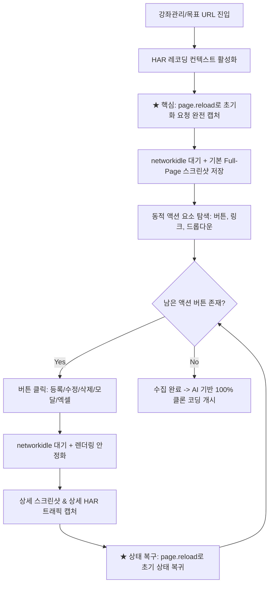

# 웹 클론 코딩 자동화 프롬프트 및 에셋 수집 전략 가이드

본 문서는 실서비스 웹사이트(예: dbdbschool 강좌관리 등)의 URL이나 HTML을 전달받았을 때, **Playwright 기반의 자동 새로고침(Reload) HAR/스크린샷 수집 파이프라인**을 통해 페이지와 모달/폼/API를 100% 완벽하게 클론 코딩하는 자동화 전략 및 실행 레퍼런스입니다.

---

## 1. 자동 새로고침(Reload) 기반 완전 HAR/에셋 수집 원리

수동으로 브라우저 개발자 도구(F12)에서 HAR을 저장할 때, **페이지 진입 후 새로고침(F5)을 해야만 초기 번들(CSS/JS/폰트), 인증 쿠키 핸드셰이크, 인라인 부트스트랩 XHR 요청이 누락 없이 100% 기록**됩니다.

이 과정을 Playwright 자동화 스크립트에서는 다음과 같이 2단계 진입 기법으로 구현합니다:



---

## 2. 단일 URL 기반 100% 클론 코딩 자동화 프롬프트

Antigravity 등 AI 에이전트에게 단일 페이지(예: 강좌관리) 주소나 사이드바 링크를 제공할 때 사용할 수 있는 프롬프트입니다:

```markdown
### [프롬프트] 강좌관리 및 하위 모달/API 100% 클론 코딩 파이프라인

내가 제공하는 다음 강좌관리 페이지 URL을 분석하여 에셋 수집부터 프론트엔드/백엔드 클론 코딩까지 완성해 줘:
- **대상 URL**: [여기에 강좌관리 URL 입력]
- **요청 작업**:
  1. Playwright를 실행하여 해당 URL로 이동한 뒤, 초기 네트워크 트래픽 및 번들 자산을 완벽히 포착하기 위해 **`page.reload(wait_until='networkidle')`**을 수행하고 기본 Full 스크린샷과 HAR을 저장한다.
  2. 페이지 내 모든 액션 버튼(강좌등록, 일괄수정, 일괄삭제, 강좌통계, 엑셀다운, 필터검색 등)을 자동 감지한다.
  3. 각 버튼을 순차적으로 클릭하여 열리는 모달/폼의 상세 스크린샷(`[메뉴명]_[버튼명]_상세.png`)과 API Payload/Response를 기록한다.
  4. 클릭 후에는 반드시 `page.reload()`로 상태를 깨끗이 초기화한 후 다음 버튼을 탐색한다.
  5. 수집된 HTML, CSS, 모달 레이아웃, HAR API 명세를 바탕으로 동일한 반응형 UI와 Express/DB 백엔드 라우트를 100% 구현하고 E2E 검증을 마친다.
```

---

## 3. 완전 자동 새로고침(Reload) Playwright 스크립트 (Python & Node.js)

### Python 버전 (`crawl_and_clone.py`)

```python
import os
import re
import time
from playwright.sync_api import sync_playwright

OUTPUT_DIR = "./crawled_assets"
SCREENSHOT_DIR = os.path.join(OUTPUT_DIR, "screenshots")
HAR_DIR = os.path.join(OUTPUT_DIR, "har")

os.makedirs(SCREENSHOT_DIR, exist_ok=True)
os.makedirs(HAR_DIR, exist_ok=True)

def sanitize(name: str) -> str:
    return re.sub(r'[\\/*?:"<>| \t\n]', '_', name).strip('_')

def run_depth_crawler(target_url: str, page_name: str = "강좌관리"):
    with sync_playwright() as p:
        # 브라우저 실행
        browser = p.chromium.launch(headless=False)
        context = browser.new_context(
            record_har_path=os.path.join(HAR_DIR, f"{page_name}_all_traffic.har"),
            record_har_mode="minimal",
            viewport={"width": 1920, "height": 1080}
        )
        page = context.new_page()

        # 브라우저 alert/confirm 자동 수락
        page.on("dialog", lambda dialog: dialog.accept())

        print(f"[*] 1. 대상 페이지 접속: {target_url}")
        page.goto(target_url, wait_until="domcontentloaded")

        # ★ 핵심: 완전한 HAR 트래픽(초기 번들, 폰트, API) 기록을 위한 자동 새로고침
        print(f"[*] 2. 자동 새로고침(Reload) 수행하여 완전한 트래픽/초기 상태 캡처...")
        page.reload(wait_until="networkidle")
        time.sleep(1)

        # 기본 페이지 캡처
        base_shot = os.path.join(SCREENSHOT_DIR, f"{page_name}_00_기본화면.png")
        page.screenshot(path=base_shot, full_page=True)
        print(f"  [OK] 기본 스크린샷 저장: {base_shot}")

        # 페이지 내 액션 버튼 탐색
        buttons = page.query_selector_all("button, input[type='button'], input[type='submit'], .btn, a.btn, a[onclick]")
        action_list = []
        for idx, btn in enumerate(buttons):
            text = (btn.inner_text() or btn.get_attribute("value") or "").strip()
            if text and len(text) <= 30:
                action_list.append({"idx": idx, "name": sanitize(text)})

        print(f"[*] 3. {len(action_list)}개의 동적 인터랙션 요소 발견. 순차 캡처 시작...")

        # 인터랙션 순회 루프
        for item in action_list:
            btn_idx = item["idx"]
            btn_name = item["name"]

            try:
                # 최신 DOM에서 버튼 재참조
                current_btns = page.query_selector_all("button, input[type='button'], input[type='submit'], .btn, a.btn, a[onclick]")
                if btn_idx >= len(current_btns):
                    continue
                target = current_btns[btn_idx]
                if not target.is_visible():
                    continue

                print(f"  -> [{btn_name}] 클릭 및 모달/폼 활성화 대기...")
                target.click(timeout=3000)
                page.wait_for_load_state("networkidle", timeout=3000)
                time.sleep(0.6) # 모달 애니메이션 대기

                # 상세 화면 캡처
                detail_shot = os.path.join(SCREENSHOT_DIR, f"{page_name}_{btn_name}_상세.png")
                page.screenshot(path=detail_shot, full_page=True)
                print(f"     [OK] 상세 캡처 완료: {detail_shot}")

            except Exception as e:
                print(f"     [!] 액션 처리 예외 무시 ({btn_name}): {e}")
            finally:
                # ★ 상태 복구: 페이지 새로고침으로 깨끗한 원상태 복귀
                page.reload(wait_until="networkidle")
                time.sleep(0.3)

        context.close()
        browser.close()
        print(f"\n[★] '{page_name}' 에셋/HAR 수집 완료! 클론 코딩 준비가 완료되었습니다.")

if __name__ == "__main__":
    TARGET_URL = "http://localhost:3005/af/ad_lec/lists/sn/3267" # 대상 주소
    run_depth_crawler(TARGET_URL, "강좌관리")
```

---

## 4. 수집 후 100% 클론 코딩 수행 단계

주소를 주시면 다음 3단계를 에이전트가 즉각 자동으로 수행합니다:

1. **에셋 수집 자동 실행**:
   - 주소 접속 $\rightarrow$ 자동 `reload`로 완벽한 초기 리소스/HAR 아카이빙 $\rightarrow$ 모든 등록/수정/삭제/통계 모달 팝업 스크린샷 캡처
2. **UI & 템플릿 100% 복제**:
   - 원본의 HTML 계층 구조, CSS 픽셀 규격, 인라인 폰트, 버튼 정렬(`height: 30px`, flex centering)을 그대로 재현
3. **API & 백엔드 완벽 연동**:
   - HAR 파일에 기록된 요청 주소, 파라미터, 응답 JSON을 파싱하여 Express 라우트 및 DB 질의를 자동 생성하고 E2E 회귀 테스트로 검증 완료
