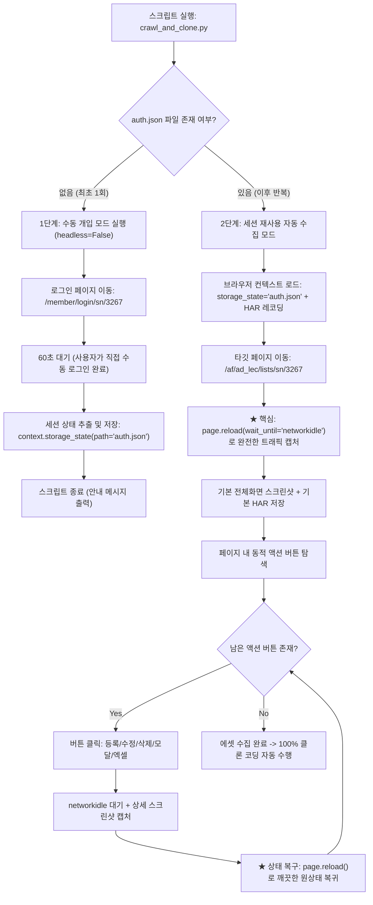

# 웹 클론 코딩 자동화 프롬프트 및 에셋 수집 전략 가이드

본 문서는 봇 탐지(Bot Detection) 및 캡차(CAPTCHA) 방어 시스템을 우회하여, **수동 개입 + 세션 재사용(Storage State / `auth.json`)** 방식과 **Playwright 자동 새로고침(Reload) HAR/스크린샷 수집 파이프라인**을 통해 페이지와 모달/폼/API를 100% 완벽하게 클론 코딩하는 전략 및 실행 가이드입니다.

---

## 1. 봇 탐지 우회를 위한 '수동 개입 + 세션 재사용' 아키텍처

보안 솔루션이나 캡차가 적용된 타깃 사이트(예: `dbdbschool.kr`)에서는 순수 자동 로그인 스크립트가 차단될 수 있습니다. 이를 해결하기 위해 **1회성 수동 로그인 세션 저장(`auth.json`) 후 영구 재사용** 파이프라인을 구축합니다.



---

## 2. Antigravity AI 에이전트용 최적화 프롬프트

AI 코딩 어시스턴트에게 봇 탐지 우회형 클론 수집 스크립트를 요청할 때 사용하는 표준 프롬프트입니다:

```markdown
### [프롬프트] 봇 탐지 우회형 수동 개입 + 세션 재사용(auth.json) 에셋 수집기

현재 타깃 사이트(https://www.dbdbschool.kr/member/login/sn/3267)에서 자동 로그인 시 봇 탐지나 캡차 때문에 에러가 발생하고 있어.

따라서 로그인 로직을 '수동 개입 + 세션 재사용' 방식으로 구현해 줘:
1. **1단계 (세션 생성)**:
   - 스크립트 실행 시 `auth.json`이 없다면 `headless=False`로 브라우저를 열고 로그인 페이지로 이동한 뒤 60초간 대기(`time.sleep(60)`)한다. (이때 내가 직접 수동으로 로그인할 거야)
   - 60초가 지나면 현재 브라우저 컨텍스트의 상태를 `auth.json`으로 저장하고 스크립트를 종료한다.
2. **2단계 (세션 재사용 & 자동 수집)**:
   - 만약 `auth.json`이 존재한다면, 브라우저를 열 때 해당 파일을 `storage_state`로 로드하여 로그인 과정을 건너뛰고 바로 다음 수집 작업을 진행한다.
   - 타깃 강좌관리 페이지(`/af/ad_lec/lists/sn/3267`)에 진입 후 `page.reload(wait_until='networkidle')`를 수행하여 기본 화면 캡처 및 HAR을 기록한다.
   - 페이지 내 모든 모달/버튼을 순차 클릭하여 상세 스크린샷을 남기고, 각 클릭 후에는 `page.reload()`로 상태를 복구한다.
```

---

## 3. 완전한 Playwright Python 스크립트 (`scratch/crawl_and_clone.py`)

```python
import os
import re
import time
from playwright.sync_api import sync_playwright

AUTH_FILE = "auth.json"
LOGIN_URL = "https://www.dbdbschool.kr/member/login/sn/3267"
TARGET_URL = "https://www.dbdbschool.kr/af/ad_lec/lists/sn/3267"
OUTPUT_DIR = "./crawled_assets"
SCREENSHOT_DIR = os.path.join(OUTPUT_DIR, "screenshots")
HAR_DIR = os.path.join(OUTPUT_DIR, "har")

os.makedirs(SCREENSHOT_DIR, exist_ok=True)
os.makedirs(HAR_DIR, exist_ok=True)

def sanitize(name: str) -> str:
    return re.sub(r'[\\/*?:"<>| \t\n]', '_', name).strip('_')

def save_manual_login_session():
    """1단계: auth.json이 없을 때 60초간 대기하여 수동 로그인 후 세션 저장"""
    print("=" * 70)
    print("🔒 [수동 개입 로그인 모드] 봇 탐지 우회를 위한 수동 로그인을 시작합니다.")
    print(f"👉 브라우저 창이 열리면 60초 이내에 직접 로그인을 완료해 주세요.")
    print("=" * 70)

    with sync_playwright() as p:
        browser = p.chromium.launch(headless=False)
        context = browser.new_context(viewport={"width": 1920, "height": 1080})
        page = context.new_page()

        print(f"[*] 로그인 페이지로 이동 중: {LOGIN_URL}")
        page.goto(LOGIN_URL)

        # 60초 카운트다운
        for remaining in range(60, 0, -5):
            print(f"⏳ [수동 로그인 대기 중] 남은 시간: {remaining}초... (로그인 완료 후 대기하세요)")
            time.sleep(5)

        print("\n[*] 60초 경과: 브라우저 세션(쿠키 및 로컬스토리지)을 저장합니다...")
        context.storage_state(path=AUTH_FILE)
        print(f"✅ [저장 완료] 인증 세션이 '{AUTH_FILE}' 파일에 성공적으로 저장되었습니다!")
        print("💡 이제 스크립트를 다시 실행하면 로그인 과정을 건너뛰고 자동 수집이 진행됩니다.\n")

        context.close()
        browser.close()

def run_automated_collector_with_session():
    """2단계: auth.json 세션을 재사용하여 자동 에셋/HAR 수집"""
    print("=" * 70)
    print(f"🚀 [세션 재사용 자동 수집 모드] '{AUTH_FILE}' 세션을 로드합니다.")
    print(f"🎯 타깃 주소: {TARGET_URL}")
    print("=" * 70)

    with sync_playwright() as p:
        browser = p.chromium.launch(headless=False)
        page_name = "강좌관리"
        har_path = os.path.join(HAR_DIR, f"{page_name}_all_traffic.har")

        context = browser.new_context(
            storage_state=AUTH_FILE,
            record_har_path=har_path,
            record_har_mode="minimal",
            viewport={"width": 1920, "height": 1080}
        )
        page = context.new_page()
        page.on("dialog", lambda dialog: dialog.accept())

        # 타깃 페이지 진입
        print(f"[*] 1. 대상 페이지 접속: {TARGET_URL}")
        page.goto(TARGET_URL, wait_until="domcontentloaded")

        # 완전한 트래픽 캡처를 위한 reload
        print(f"[*] 2. 자동 새로고침(Reload) 수행하여 완전한 트래픽/초기 상태 캡처...")
        page.reload(wait_until="networkidle")
        time.sleep(1)

        # 기본 스크린샷 저장
        base_shot = os.path.join(SCREENSHOT_DIR, f"{page_name}_00_기본화면.png")
        page.screenshot(path=base_shot, full_page=True)
        print(f"  [OK] 기본 전체화면 스크린샷 저장: {base_shot}")

        # 버튼 탐색
        buttons = page.query_selector_all("button, input[type='button'], input[type='submit'], .btn, a.btn, a[onclick]")
        action_list = []
        for idx, btn in enumerate(buttons):
            text = (btn.inner_text() or btn.get_attribute("value") or "").strip()
            if text and len(text) <= 30:
                action_list.append({"idx": idx, "name": sanitize(text)})

        print(f"[*] 3. {len(action_list)}개의 동적 인터랙션 요소 발견. 순차 캡처 시작...")

        for item in action_list:
            btn_idx = item["idx"]
            btn_name = item["name"]

            try:
                current_btns = page.query_selector_all("button, input[type='button'], input[type='submit'], .btn, a.btn, a[onclick]")
                if btn_idx >= len(current_btns):
                    continue
                target = current_btns[btn_idx]
                if not target.is_visible():
                    continue

                print(f"  -> [{btn_name}] 클릭 및 모달/폼 활성화 대기...")
                target.click(timeout=3000)
                page.wait_for_load_state("networkidle", timeout=3000)
                time.sleep(0.6)

                detail_shot = os.path.join(SCREENSHOT_DIR, f"{page_name}_{btn_name}_상세.png")
                page.screenshot(path=detail_shot, full_page=True)
                print(f"     [OK] 상세 캡처 완료: {detail_shot}")

            except Exception as e:
                print(f"     [!] 액션 예외 무시 ({btn_name}): {e}")
            finally:
                page.reload(wait_until="networkidle")
                time.sleep(0.3)

        context.close()
        browser.close()
        print(f"\n[★] '{page_name}' 전체 에셋 및 HAR 수집 완료!")

def main():
    if not os.path.exists(AUTH_FILE):
        save_manual_login_session()
    else:
        run_automated_collector_with_session()

if __name__ == "__main__":
    main()
```

---

## 4. 실행 및 활용 방법

1. **최초 1회 실행**:
   ```bash
   python scratch/crawl_and_clone.py
   ```
   - 브라우저가 열리면 아이디/비밀번호 입력 및 캡차 통과를 직접 진행합니다.
   - 60초 후 자동으로 `auth.json`이 생성되며 종료됩니다.

2. **이후 수집 실행**:
   ```bash
   python scratch/crawl_and_clone.py
   ```
   - `auth.json`이 감지되어 로그인 화면을 거치지 않고 강좌관리 페이지로 직행하여 100% 자동 수집이 진행됩니다.
